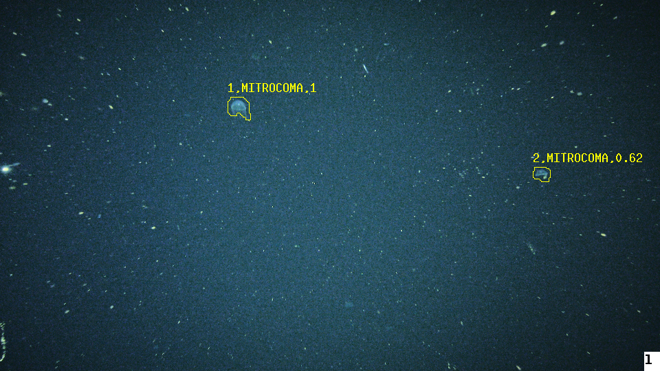

## Running pascalvocvision

This combines PASCAL Visual Object Class (VOC) formatted bounding box classifications with the object tracking system 
in *salientvision*. This is still in the early stages of development, but showing promise as a combined top-down bottom-up approach.

## Requirements
*  Data must be in XML files formatted in the same manner as the examples provided in midwater and benthic examples.
*  Currently there is no support to separate the XML files from the image input; the input images and XML must 
reside in the same directory

## Examples


### Midwater 



A small example is available in the data/midwater folder. These images were extracted a video clip recorded
at approximately 300 meters depth from an autonomous underwater vehicle.  

Data was trained with the [faster_rcnn_resnet101_coco_300_smallanchor_random_crop_image_mean_stride8](https://github.com/underh20cv/tfdetection/tree/master/models/faster_rcnn_resnet101_coco_300_smallanchor_random_crop_image_mean_stride8)
model and run on each frame in the sequence first.

First uncompress the example with:
 
```bash 
cd data/midwater
tar -vzxf midwaterdata.tar.gz
```

Run with

```bash

docker run -e DISPLAY=host.docker.internal:0 -v $PWD:/data aved/pascalvocvision  \
--in=raster:/data/f#.png --input-frames=1-5@1 --output-frames=1-5@1 --out=raster:/data/  \
 --mbari-save-events-xml=/data/events.xml --mbari-display-results  --mbari-mark-interesting=Outline \
 --logverb=Info --rescale-input=960x540 --mbari-save-output --mbari-save-results

```
