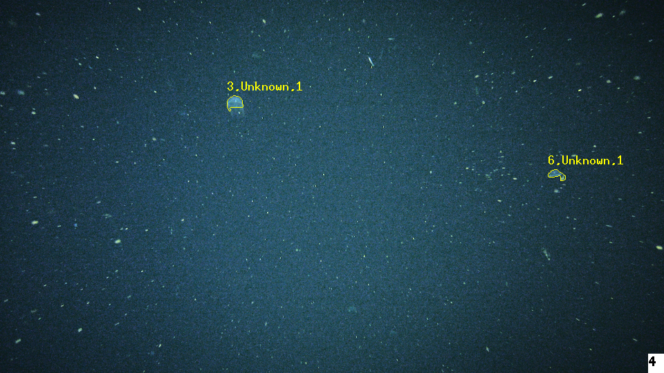
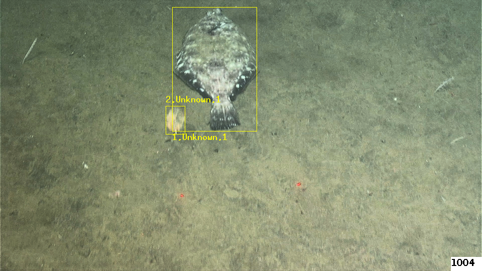

## Running salientvision

The software that runs the automated visual event detection and tracking is called *salientvision*.
It's a command-line tool that can either take a series of sequential frames, or a single frame.

 
## Examples


### Midwater 


A small example is available in the data/midwater folder. These images were extracted a video clip recorded
at approximately 300 meters depth from an autonomous underwater vehicle.  

First uncompress the example with:
 
```bash 
cd data/midwater
tar -vzxf midwaterdata.tar.gz
```
Process first 5 frames, run saliency detection very two frames on rescaled 960x540 images,  save the
output to events.xml file, set minimum area to 50 square pixels and mark objects with an outline (instead of bounding box)
```bash 
docker run -v $PWD:/data aved/salientvision --in=raster:/data/f#.png  --input-frames=1-5@1 --output-frames=1-5@1 \
--out=raster:/data/  --mbari-save-events-xml=/data/events.xml --mbari-saliency-dist=2 --mbari-mark-interesting=Outline \
--mbari-min-event-area=50 --mbari-save-output  --rescale-input=960x540 
```


To see displayed intermediate results as it's running. This can be useful for debugging and understanding the algorithm.
```bash 
xhost + 127.0.0.1
docker run -e DISPLAY=host.docker.internal:0 -v $PWD:/data aved/salientvision --in=raster:/data/f#.png \
--input-frames=1-5@1 --output-frames=1-5@1 --out=raster:/data/  --mbari-save-events-xml=/data/events.xml \
--mbari-saliency-dist=2 --mbari-mark-interesting=Outline --mbari-min-event-area=50 --rescale-input=960x540 \
--mbari-display-results --mbari-save-output --mbari-rescale-display=640x480
```
  
### Benthic


```bash 
cd data/benthic
tar -vzxf benthicdata.tar.gz
```
Process first 5 frames running saliency every 2 frames, starting at 1000, rescaled to 960x540,  
save output to events.xml file 
```bash 
docker run -v $PWD:/data aved/salientvision --in=raster:/data/f#.png  --input-frames=1001-1010@1 \
--output-frames=1001-1010@1 --out=raster:/data/  --mbari-save-events-xml=/data/events.xml  \
--mbari-saliency-dist=2 --mbari-save-output --rescale-input=960x540
```

To see displayed intermediate results as it's running. This can be useful for debugging and understanding the algorithm.
```bash 
docker run -e DISPLAY=host.docker.internal:0  -v $PWD:/data aved/salientvision --in=raster:/data/f#.png  \
--input-frames=1001-1010@1 --output-frames=1001-1010@1 --out=raster:/data/  --mbari-save-events-xml=/data/events.xml \
--mbari-save-output --rescale-input=960x540
``` 

There are many [options](doc/SALIENTVISIONOPTS.md) in salientvision, some simple like setting the minimum and maximum allowable event areas.  See more [here](OPTIONS.md), or display the options with:

 ```bash 
docker run aved/salientvision --help
```
